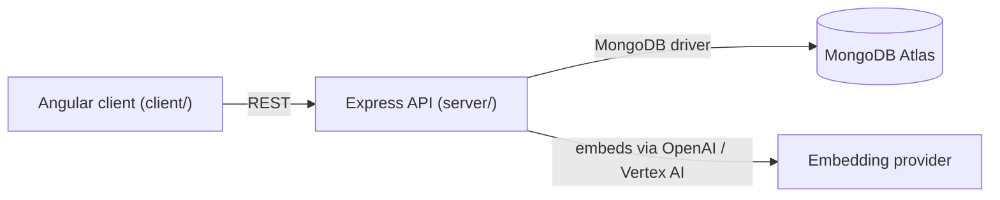

# Library Management System

[](https://codespaces.new/mongodb-developer/library-management-system)

A full-stack library app — browse a catalog, borrow and reserve books, leave reviews —
built on the MEAN stack (MongoDB, Express, Angular, Node.js). It's the sample app used
in MongoDB Developer Days hands-on labs, so the codebase intentionally shows off
several MongoDB schema design patterns and MongoDB Search / MongoDB Vector Search side by side,
not just CRUD.

## Capabilities

- Browse, add, edit, and delete books, each with authors, genres, and free-form
  attributes (edition, ISBN, dimensions, MSRP)
- Borrow and return books, with due dates and history, or reserve a book that's
  currently checked out
- Leave and read reviews per book
- Role-based access: admin-only routes for managing inventory and borrow records
- Workshop labs for full-text and vector search over the book catalog, including
  prefiltering and scalar quantization variants of a Vector Search index

## Architecture overview



The client is a standalone Angular SPA; the server is an Express + TypeScript API. The
two talk over HTTP only — there's no server-side rendering or shared process. The
server owns all MongoDB access; embedding generation for search is a pluggable
provider selected at runtime (see [AGENTS.md](./AGENTS.md)).

## Quick start

### Prerequisites

| What | Notes |
| --- | --- |
| **Node.js 20 or 22** | Node 20 LTS is what CI uses. Check with `node -v`. Angular 16 does not support Node 16. |
| **npm** | Ships with Node. `npm ci` also works everywhere here. |
| **Docker Desktop** *(recommended)* or a **MongoDB** instance | Docker is the fastest way to get a local MongoDB. An [Atlas free tier (M0) cluster](https://www.mongodb.com/cloud/atlas/register?utm_campaign=devrel&utm_source=github&utm_medium=referral&utm_content=library_management_system&utm_term=learning.fuel) or a local `mongod` works too. |

### Option A — local Docker (fastest, no MongoDB install needed)

```bash
npm run setup     # installs root + server + client deps and creates server/.env
npm run db:start  # starts MongoDB 8 in Docker on localhost:27017
npm run db:seed   # loads the 6,777-book sample catalog (needs no extra tooling)
npm run dev       # API on http://localhost:5400 + Angular app on http://localhost:4200
```

Open **http://localhost:4200**. The header auto-logs you in as a randomly named user
(that user is created in the `users` collection) and the catalog loads.

### Option B — GitHub Codespaces

Click the badge above, or **Code → Codespaces → Create codespace on main**. The dev
container starts MongoDB, restores the sample data and opens server/client terminal
tabs. Open the forwarded port for **4200** (opens automatically).

### Option C — MongoDB Atlas instead of Docker

1. Create a free M0 cluster, then **Connect → Drivers** and copy the SRV string.
2. Put it in `server/.env`:

   ```
   PORT=5400
   DATABASE_URI=mongodb+srv://<user>:<password>@<cluster>.mongodb.net
   DATABASE_NAME=library
   SECRET=secret
   ```
3. `npm run setup && npm run db:seed && npm run dev` — the seeder writes into the same
   `library` database, so you get the sample catalog in Atlas too. (Allowlist your IP
   under **Network Access** first, or the connection will time out.)

> The Atlas **Search / Vector Search workshop labs** need MongoDB Search, which the
> plain `mongo:8` container does not have — switch the `mongodb` service in
> `docker-compose.yml` to `mongodb/mongodb-atlas-local` (see the comment there) or use
> an Atlas cluster for those.

## Running it in VS Code

1. **Open the repo folder**: `File → Open Folder…` → the repository root (the folder
   that contains `package.json`, `server/` and `client/`). Install the recommended
   extensions when VS Code offers them (bottom-right toast).
2. **Open a terminal** (`` Ctrl+` ``) and run the three setup commands:

   ```bash
   npm run setup
   npm run db:start     # skip if you use Atlas / your own mongod
   npm run db:seed
   ```
3. **Start the app** — either of these:
   - Terminal: `npm run dev`, then open http://localhost:4200 (the Angular dev server
     proxies `/api` to the Express API, so you only need the one URL).
   - **Run and Debug** view (`Ctrl+Shift+D`) → pick **“Full stack: API + Client”** → `F5`.
     That starts the API and the client in two terminals. **“API: debug (inspect)”**
     attaches a real Node debugger so you can put breakpoints in `server/src/**/*.ts`.
4. **Task shortcuts**: `Terminal → Run Task…` lists numbered tasks (setup, start DB,
   seed, run everything, lint + tests, production build).
5. **Look at the data**: the MongoDB for VS Code extension adds a **MongoDB** sidebar;
   it already has a “Library DB” connection preset pointing at `mongodb://localhost:27017`
   (see `.vscode/settings.json`) → expand it to browse `library.books`, and use
   **Play with Schema** to inspect the embedded `authors` / `reviews` arrays.

Both sub-projects are separate npm packages on purpose (`server/` = ESM TypeScript API,
`client/` = Angular 16); each has its own `tsconfig.json`, so VS Code gives you correct
IntelliSense per file without extra setup. There is no workspace-level `node_modules`
dependency between them — `npm run install:all` is what keeps them in sync.

## Every command you need

From the repo root:

| Command | Does |
| --- | --- |
| `npm run setup` | install root + server + client deps, create `server/.env` from the template |
| `npm run db:start` / `db:stop` / `db:down` | Docker Compose lifecycle for the local MongoDB |
| `npm run db:reset` | drop the Docker volume (wipes data) — re-run `db:seed` afterwards |
| `npm run db:seed` | load `.devcontainer/data/library/*.bson` into `DATABASE_NAME` (`--dry-run`, `--keep`, `--uri`, `--db` supported) |
| `npm run dev` | API (`build:watch` + nodemon on 5400) and Angular dev server (4200) together |
| `npm run dev:server` / `dev:client` | just one of them |
| `npm run debug:server` | build, then run the API with `--inspect` on 9229 for the VS Code attach config |
| `npm run build` | `tsc` for the server + `ng build` for the client |
| `npm run lint` | ESLint over `server/src` |
| `npm test` | server lint-free API suite: builds, boots on port 5200 against `testLibrary`, runs mocha |
| `npm run db:logs` | tail the MongoDB container logs |

Inside `server/` you can still use the originals: `npm start`, `npm run build`,
`npm run serve`, `npm run build:watch`, `npm run api-test`, `npm run lint`, `npm test`.
Inside `client/`: `npm start`, `npm run build`, `npm test` (Karma).

## Environment variables

`server/.env` is **git-ignored**; `server/.env.example` is the template and
`npm run setup` copies it for you. The server loads it relative to its own file, so it
works from any working directory (`npm start`, nodemon, a debugger, `node dist/server.js`).

| Name | Required | Default here | Description |
| --- | --- | --- | --- |
| `PORT` | yes | `5400` | Express port; must match `client/proxy.conf.json` |
| `DATABASE_URI` | yes | `mongodb://127.0.0.1:27017` | MongoDB connection string |
| `DATABASE_NAME` | yes | `library` | Database the app uses (and that `db:seed` fills) |
| `SECRET` | yes | `secret` | HS256 secret for the demo JWTs |
| `EMBEDDINGS_SOURCE` | no | `serverlessEndpoint` | `openai` \| `googleVertex` \| `serverlessEndpoint` (vector-search lab only) |
| `EMBEDDING_KEY` | no | — | API key for the embedding provider (vector-search lab only) |

## Troubleshooting

| Symptom | Cause / fix |
| --- | --- |
| ASCII-art error mentioning `DATABASE_URI` at server start | `server/.env` is missing or still has the placeholder. Run `npm run setup`, or copy `server/.env.example` to `server/.env`. |
| `connect ECONNREFUSED 127.0.0.1:27017` / `getaddrinfo ENOTFOUND` | MongoDB isn't reachable: `npm run db:start` (Docker running?) or point `DATABASE_URI` at Atlas and check Network Access. |
| Server starts, catalog is empty | You connected to an unseeded database: `npm run db:seed`. Check `DATABASE_NAME` matches what you seeded. |
| UI shows “Failed to load” but `http://localhost:5400` answers | The API isn't up or `client/proxy.conf.json` doesn't point at its `PORT`. Restart with `npm run dev`. |
| `401 Invalid Token` on borrow/create/delete | The JWT is signed with `SECRET`; changing `SECRET` while the app runs invalidates existing tokens — log out (or clear `localStorage`) and reload. |
| `npm run build` in `client/` fails on “Inlining of fonts” | Needs network access to Google Fonts. Font inlining is disabled in `client/angular.json` (production `optimization.fonts: false`), so the build works offline; the `<link>` in `index.html` still loads the icon font at runtime when online. |
| Angular 16 complains about the Node version | Use Node 20 or 22 (`nvm install 20 && nvm use 20`). |
| `git commit` is blocked by the pre-commit hook | The hook runs server lint + API tests (needs Docker/MongoDB). It skips the tests when Docker isn't installed; `git commit --no-verify` skips everything. |
| Port already in use | `PORT`/`5400` or `4200` taken: change `PORT` in `server/.env` **and** `client/proxy.conf.json`, or `ng serve --port 4300`. |

## MongoDB features demonstrated

### Why MongoDB?

- **Flexible schema for a catalog with wildly inconsistent source data.** Books come
  with different attributes depending on edition and publisher; the
  [Attribute Pattern](https://www.mongodb.com/blog/post/building-with-patterns-the-attribute-pattern?utm_campaign=devrel&utm_source=github&utm_medium=referral&utm_content=library_management_system&utm_term=learning.fuel)
  stores those as key/value pairs instead of a rigid column set.
- **Reads that don't fan out.** A book page needs its authors and recent reviews in
  one round trip; the
  [Extended Reference](https://www.mongodb.com/blog/post/building-with-patterns-the-extended-reference-pattern?utm_campaign=devrel&utm_source=github&utm_medium=referral&utm_content=library_management_system&utm_term=learning.fuel)
  and
  [Subset](https://www.mongodb.com/blog/post/building-with-patterns-the-subset-pattern?utm_campaign=devrel&utm_source=github&utm_medium=referral&utm_content=library_management_system&utm_term=learning.fuel)
  patterns duplicate just enough of that related data inline to avoid a join-like
  lookup on every page view.
- **One collection instead of two nearly-identical ones.** Borrowed books and
  reservations differ by only a few fields, so the
  [Single Collection Pattern](https://www.mongodb.com/blog/post/building-with-patterns-the-single-collection-pattern?utm_campaign=devrel&utm_source=github&utm_medium=referral&utm_content=library_management_system&utm_term=learning.fuel)
  keeps them together and discriminates with a `recordType` field.
- **Search and recommendations without a second database.**
  [MongoDB Search](https://www.mongodb.com/docs/atlas/atlas-search/?utm_campaign=devrel&utm_source=github&utm_medium=referral&utm_content=library_management_system&utm_term=learning.fuel)
  and
  [MongoDB Vector Search](https://www.mongodb.com/docs/atlas/atlas-vector-search/?utm_campaign=devrel&utm_source=github&utm_medium=referral&utm_content=library_management_system&utm_term=learning.fuel)
  run against the same `books` collection the app already reads and writes — no
  separate search cluster to keep in sync.

## Contributing

Merge your own PR once you have at least one approval from a
[code owner](.github/CODEOWNERS).

## License

This project is licensed under the [Apache 2.0 License](LICENSE). Use at your own
risk — not a supported MongoDB product.

## Getting support

If you run into a problem working through this app,
[open a new issue](https://github.com/mongodb-developer/library-management-system/issues/new).
